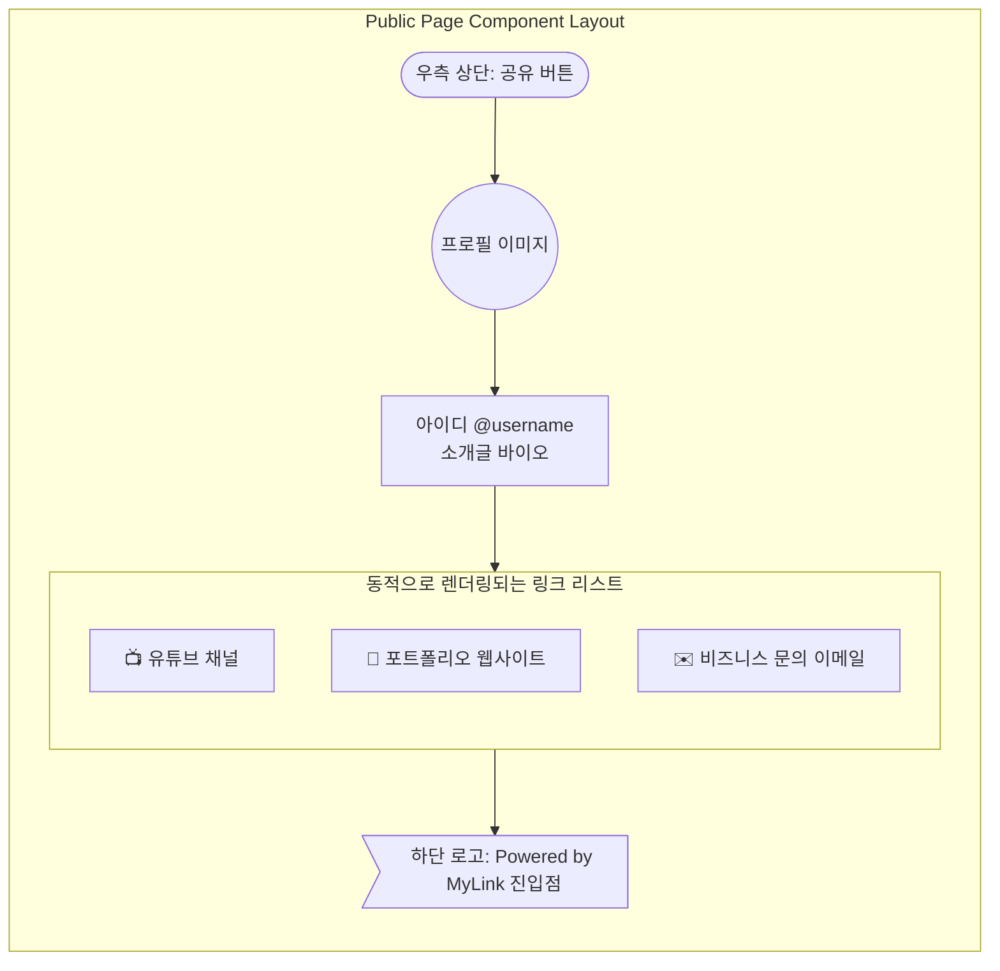
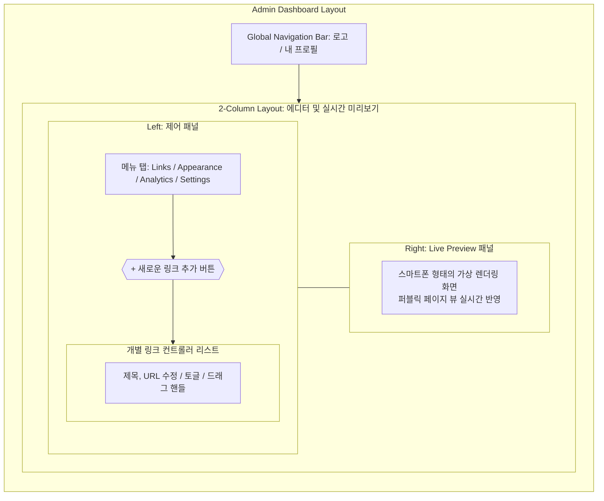

# 마이링크 (MyLink) - 화면 와이어프레임 (Wireframe)

서비스의 핵심이 되는 두 가지 화면(퍼블릭 페이지, 관리자 대시보드)에 대한 화면 구성을 설계합니다.

---

## ⚙️ 공통 UI/UX 정책 (합의 완료)
- **PC 레이아웃 (반응형):** 넓은 모니터 환경에서도 퍼블릭 페이지는 모바일 화면 비율의 **가운데 고정된 컨테이너 영역** 안에 콘텐츠를 표시합니다.
- **공유 피드백 (UX):** 링크 복사 등 사용자 액션 성공 시, 딱딱한 기본 알람(alert) 대신 화면에 부드럽게 나타나는 **토스트 메시지(Toast Message: "클립보드에 복사되었습니다")**를 사용합니다.

---

## 1. 퍼블릭 페이지 (방문자 뷰)

방문자가 접속했을 때 보게 되는 모바일 환경 기준의 화면 레이아웃입니다. 직관적이고 깔끔한 UI를 지향합니다.

### 📊 Mermaid UI (구조 다이어그램)


### 🎨 ASCII Art UI (시각적 Mockup)
```text
      +-------------------------+
      |              [공유 아이콘] |
      |                         |
      |       ( * O * )         | <- 프로필 아바타 이미지
      |                         |
      |       @my_username      |
      |   안녕하세요. 환영합니다!   |
      |                         |
      |  +-------------------+  |
      |  | 📺 유튜브 채널      |  |
      |  +-------------------+  |
      |                         |
      |  +-------------------+  |
      |  | 💼 포트폴리오 웹    |  |
      |  +-------------------+  |
      |                         |
      |      [ MyLink 만들기 ]    | <- 바이럴 유입 로고
      +-------------------------+
```

---

## 2. 관리자 대시보드 (소유자 뷰)

링크 소유자가 로그인 후 진입하는 설정 페이지입니다. 링크 관리 및 수정 기능이 중심이 됩니다.

### 📊 Mermaid UI (구조 다이어그램)


### 🎨 ASCII Art UI (시각적 Mockup)
```text
+-------------------------------------------------------------------------------+
|  [Logo] MyLink                          [ 1@email.com ▼]  [ Live 변경 저장 💾] |
+-------------------------------------------------------------------------------+
|                                     |                                         |
|  [ Links ] [ Appearance ] [ Stats ] |           [ Live Preview ]              |
|                                     |                                         |
|  +-------------------------------+  |      +-------------------------+        |
|  |  [+] 새로운 링크 추가             |  |      |              [공유 아이콘] |        |
|  +-------------------------------+  |      |                         |        |
|                                     |      |       ( * O * )         |        |
|  [==== ⠿ 📺 유튜브 채널    [Toggle] ] |      |                         |        |
|  [      https://.... [수정] [삭제] ] |      |       @my_username      |        |
|                                     |      |   안녕하세요. 환영합니다!   |        |
|  [==== ⠿ 💼 포트폴리오 웹   [Toggle] ] |      |                         |        |
|  [      https://.... [수정] [삭제] ] |      |  +-------------------+  |        |
|                                     |      |  | 📺 유튜브 채널      |  |        |
|                                     |      |  +-------------------+  |        |
|                                     |      |                         |        |
|                                     |      |  +-------------------+  |        |
|                                     |      |  | 💼 포트폴리오 웹    |  |        |
|                                     |      |  +-------------------+  |        |
|                                     |      |      [ MyLink 만들기 ]   |        |
|                                     |      +-------------------------+        |
+-------------------------------------------------------------------------------+
```
